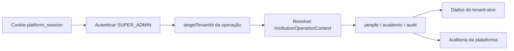

# Contexto institucional global para SUPER_ADMIN
**Alinhamento posterior:** este design descreve a implementação inicial. A ADR 0016 retirou a gravação de auditoria das operações globais no MVP e a implementação atual preserva o módulo e requisito para o sistema completo.
## Objetivo
Validar o MVP sem gestão de acesso dentro de cada instituição. Um `SUPER_ADMIN` autenticado deve poder operar dados institucionais em qualquer área do sistema, sempre indicando explicitamente a instituição-alvo pelo seu ID interno em cada operação. A centralização não permite mistura de dados: cada leitura ou escrita continua limitada ao tenant resolvido para aquela operação.
## Decisões aprovadas
- O `SUPER_ADMIN` é a única autoridade para operações institucionais no MVP de validação. `TENANT_ADMIN`, `ACADEMIC_SECRETARY` e outros papéis internos não autorizam essas operações.
- Cada operação institucional global recebe `targetTenantId`; não há instituição selecionada ou persistida na sessão global.
- O ID interno identifica a instituição-alvo. O servidor valida que ela existe antes de chamar o caso de uso.
- O servidor autentica a sessão global antes de resolver o alvo. Um cliente não pode criar um contexto institucional apenas enviando um `tenantId`.
- Escritas globais sobre dados institucionais registram auditoria de plataforma com autor `SUPER_ADMIN`, instituição-alvo, ação e data. Quando o módulo já possuir auditoria tenant-scoped, ela registra também o fato institucional correspondente.
- A criação da própria instituição permanece uma operação sem instituição-alvo anterior; as demais operações institucionais usam o novo contexto.
## Arquitetura
O módulo de operação global expõe uma interface pequena para resolver um `InstitutionOperationContext`. Ele recebe o principal da sessão global e o `targetTenantId`, exige `SUPER_ADMIN`, consulta a existência do tenant por um contrato de instituição e devolve um contexto imutável com a autoria global e o tenant-alvo.
Os módulos `people`, `academic` e `audit` consomem esse contexto por interfaces públicas. Eles não recebem permissões internas, sessão institucional ou detalhes de HTTP/SQL. Adaptadores encapsulam a consulta da instituição-alvo e a persistência das auditorias.

## Primeiro recorte
O primeiro recorte usa `people`, pois o módulo já possui cadastro e consulta. As rotas globais de pessoas recebem `targetTenantId` no corpo e chamam os mesmos casos de uso por meio do contexto institucional global. O `SUPER_ADMIN` consegue criar, consultar por ID e buscar por identificador apenas dentro do alvo enviado naquela chamada.
O catálogo de cursos adota o mesmo contexto quando sua especificação de campos e ciclo de vida estiver completa. Não antecipar sua implementação nesta entrega.
## Contratos e erros
- Sessão global inexistente, expirada ou inválida retorna `UNAUTHENTICATED`.
- Principal sem papel `SUPER_ADMIN` retorna `FORBIDDEN`.
- `targetTenantId` ausente ou não textual retorna `INVALID_INPUT`; um ID textual que não corresponde a instituição existente retorna `NOT_FOUND`.
- Uma leitura de pessoa por ID ou identificador é sempre limitada ao tenant-alvo do contexto; um identificador de outro tenant se comporta como não encontrado.
- Falha ao gravar auditoria obrigatória impede a conclusão da escrita institucional.
- Erros não expõem detalhes de adaptador, banco, contas ou instituições não relacionadas à operação.
## Interface de validação do MVP
A tela global pode receber o ID interno da instituição-alvo para cada ação de teste. Esse valor não é salvo como seleção ativa. A interface não inclui administração de papéis internos, configuração de permissões, cadastro de contas institucionais ou um seletor persistente de tenant.
## Testes
- No seam unitário, o serviço público que resolve e opera o contexto global usa store em memória, relógio e IDs determinísticos.
- Cobrir criação e consulta de pessoa por `SUPER_ADMIN` no tenant-alvo, busca por identificador, negação sem sessão global, alvo inexistente e isolamento entre dois tenants.
- Cobrir auditoria de plataforma atômica para uma escrita global e falha sem estado parcial.
- A suíte HTTP autentica uma sessão global real por fixture e confirma o contrato de `targetTenantId` sem aceitar contexto institucional forjado.
- A suíte SQLite em memória verifica o adaptador de tenant, dados e auditoria sem depender de banco externo.
## Fora de escopo
- Remover imediatamente login e permissões institucionais existentes; eles ficam isolados como legado até decisão de limpeza.
- Delegar operações a `TENANT_ADMIN`, `ACADEMIC_SECRETARY`, professor, aluno, responsável ou leitor.
- Seleção persistente de instituição na sessão, troca de contexto por interface ou preferência de usuário.
- Implementar catálogo de cursos, ofertas, ciclos, matrículas, regras acadêmicas ou componentes curriculares.
- Gerenciar múltiplos sistemas além das áreas internas do monólito modular atual.
## Consequências conhecidas
O código atual ainda provisiona conta `TENANT_ADMIN` e possui rotas com sessão institucional. Elas não correspondem à autoridade do MVP definida aqui; a primeira implementação global não as remove, mas novas operações institucionais devem usar o contexto global. A limpeza desse legado será uma decisão posterior, depois que o fluxo centralizado estiver demonstrado.
## Referências
- [Glossário](../CONTEXT.md)
- [ADR 0014 — Operação institucional centralizada pelo SUPER_ADMIN no MVP](../adr/0014-operacao-centralizada-pelo-super-admin-no-mvp.md)
- [ADR 0013 — Persistência desacoplada por adaptadores](../adr/0013-persistencia-por-adaptadores.md)
- [Spec do catálogo institucional de cursos](../../.scratch/catalogo-cursos/spec.md)
